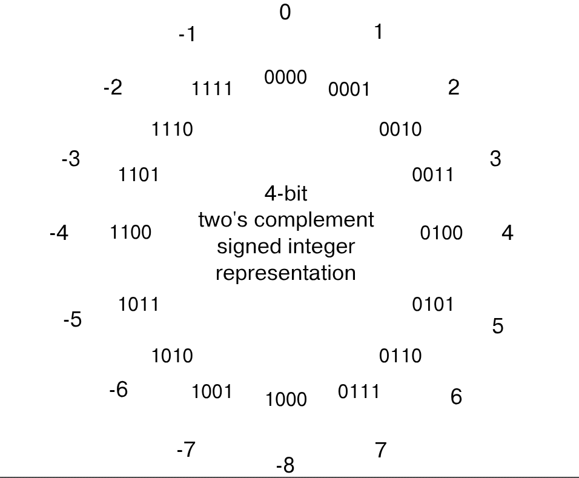
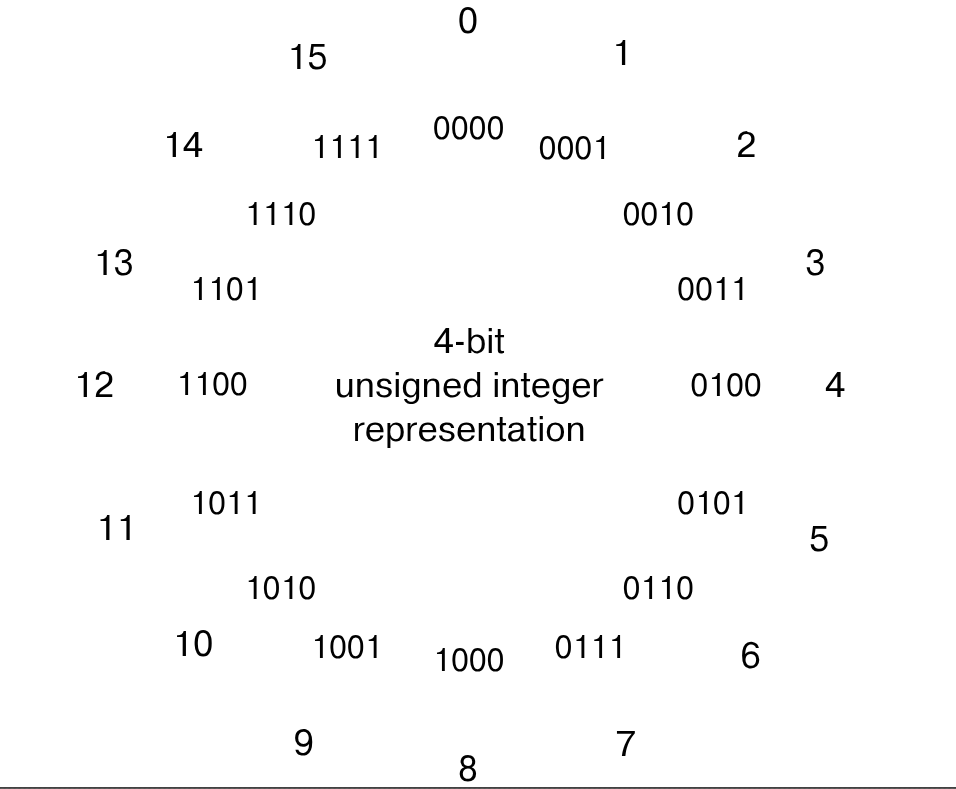
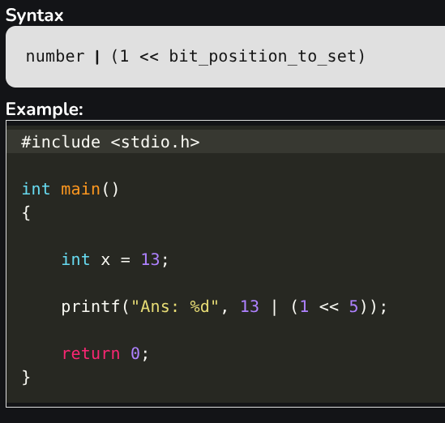
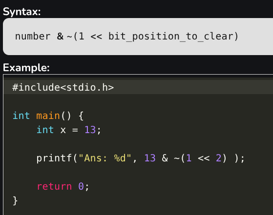
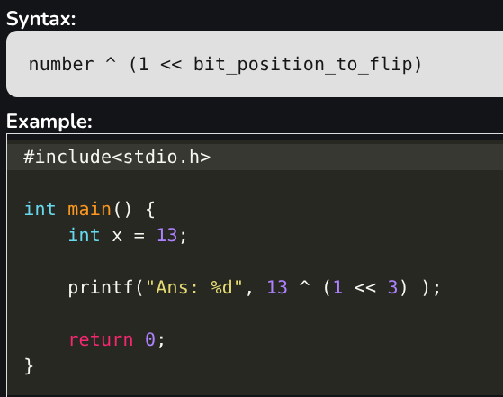
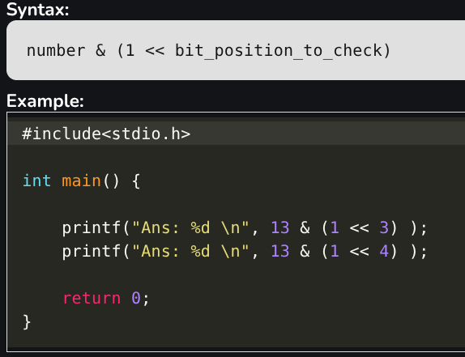
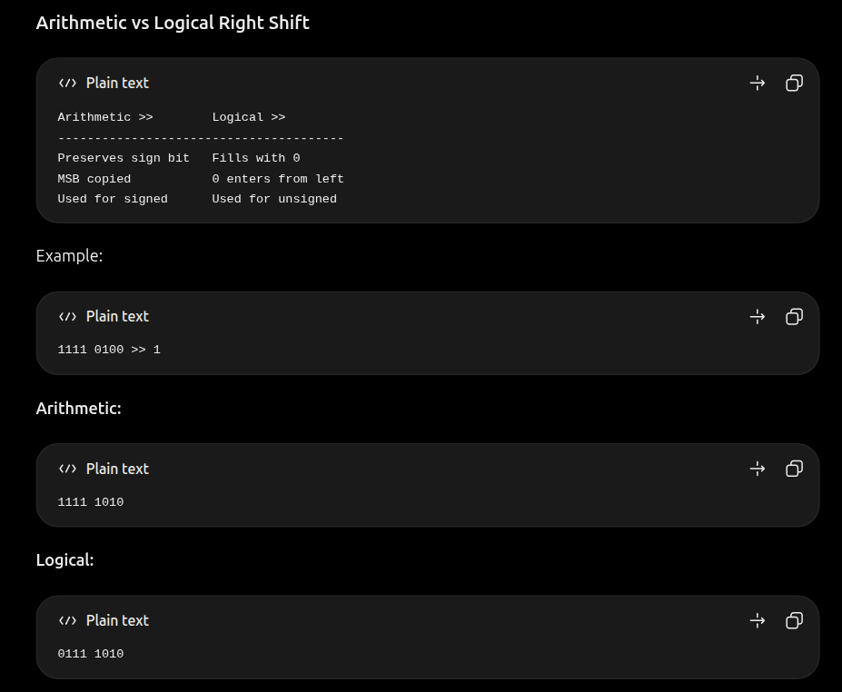

`&` → KEEP/FILTER

Think: 
> "I only want bits that are 1 in both."

This is why AND is useful for **masking/checking bits**. 

`|` → SET / TURN ON 

Think: 
> "If either side has a 1, the result gets a 1."

`^` → DIFFER/TOGGLE

`~` → FLIP EVERYTHING





```text
n-bit signed:

minimum = -2^(n-1)
maximum =  2^(n-1) - 1
```

```text
1000 0000

unsigned → 128
signed   → -128
```

`>>`    -> Right shift
`<<`    -> Left Shift

```text
x << n ≈ x × 2ⁿ
```

Right Shift
1. Arthematic Right Shift: preserves sign bit 
2. Logical Right Shift: fill with 0

---
Bit Masking

1. Setting a Bit


2. Clearing a Bit


3. Flipping a Bit


4. Checking a Bit


Logical vs Bitwise thinking

`~n + 1 = -n`




