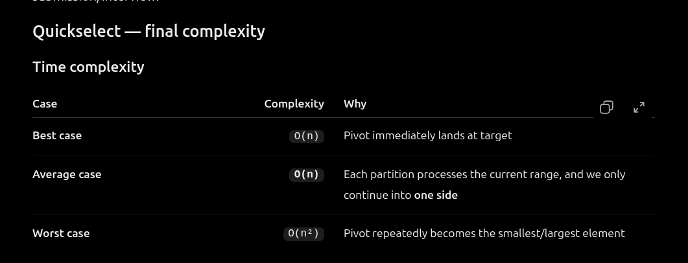

Algorithm:       Quickselect
Purpose:         Find K smallest elements
Partition:       Lomuto
Target index:    K - 1
Average time:    O(n)
Best time:       O(n)
Worst time:      O(n²)
Auxiliary space: O(1)
Output space:    O(k)
Result order:    Not necessarily sorted
In-place:        Yes

