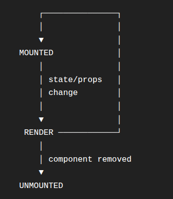

React Mental Model 

State / Props --> Components function runs --> New UI description --> React compares old vs new --> Reconciliation --> Necessary DOM changes

State 
    useState
    initial state
    setter
    re-render
    batching
    functional updates

Hooks
    useEffect
    dependency array
    useCallback

Perfromance
    React.memo
    props
    referential equality
    when a child re-renders

Interview 
    "What exactly happens internally when `setCount(count + 1)` is called?"
    "Why doesn't calling `setCount()` immediately change the `count` variable inside the current function?"

Part 1
```js
function Counter() {
    return <h1>Hello</h1>;
}
```

    React job -> Describe what the UI should look like 
    component -> a function that produces a description of UI

    Component -> UI description -> React -> DOM

    your component function is not the DOM itself

    1. State causes a component to render again 
```js
function Counter() {
    const [count, setCount] = React.useState(0); 

    return (
        <button onClick={() => setCount(count + 1)}>
            {count}
        </button>
    );
}
```

    Mental Model

        setCount(...) => state update scheduled => React renders component again => new UI desciption => compare with previous => commit necessary DOM changes

        NOT 
            setCount(...) => browser reload
    
    2. useState
        Basic syntax:
```javascript
const [count, setCount] = useState(0); 
```
        count -> current state value
        setCount -> function used to request a state update
        useState(0) -> initale value = 0; 
        useState() -> initial value = undefined
        useState(null) -> null
        useState("") -> empty string


    3. VERY IMPORTANT - State updates are not ordinary variable assignments
```javascript
const [count, setCount] = useState(0); 

function handleClick(){
    setCount(count + 1); 
    console.log(count); 
}
```

        Wrong Thinking: setCount(1) -> count becomes 1 -> console.log -> 1 [X]
        Right mental Model: 
            Current render:
            count = 0

            handleClick()
                |
                ├── setCount(1)
                |
                └── current render's count is still 0
    
        react schedules the update

        Then react renders the componet again:
            New render: 
            count = 1

        Think of each render as having it's own snapshot of state

    4. The famous double setState question
```javascript
function Counter() {
    const [count, setCount] = React.useState(0); 

    const handleClick = () => {
        setCount(count + 1); 
        setCount(count + 1); 
    };

    return <button onClick={handleClick}>{count}</button>;
}
```
        Questions: 
> What happens after one click? 
        This is a very importnat intervie concept
        At the beginning: 
`count = 0`
    Both expressions see: 
`count = 0`
    So: 
```javascript
setCount(count + 1); 
```
    becomes: 
```javascript
setCount(1); 
```
    And the second one also becomes: 
```javascript
setCount(1); 
```
    So the result is: 
`1`
not: 
`2`

    5. Then how do I actually increment twice? 
    Use a fnctional state update
```javascript
setCount(c => c + 1); 
setCount(c => c + 1); 
```
    Now React can process them sequentially
    inital c = 0

    first: 
    0 -> 1
    second: 
    1 -> 2

    So:
        setCount(count + 1)
        setCount(count + 1)
    is different from: 
        setCount(c => c + 1)
        setCount(c => c + 1)

    Interview question
    Q: Why use functional updates? 
    Because when teh next state depends on teh previous staet, the functional form explicitly tells React: 
> "Take whatever the latest state value is and calculate the next one from it."

PART 2 - React's DOM Model

OLD UI
 ↓
<h1>Count: 10</h1>
<button>Increment</button>

        ↓ compare

NEW UI
 ↓
<h1>Count: 11</h1>
<button>Increment</button>

React determines that the relevant text/content changed and commits the necessary DOM update

-> Reconciliation

6. Virtual DOM 

Component
    ↓
React's UI representation
    ↓
Reconciliation
    ↓
Real DOM updates

Interview answer

if interviewer asks: 
> What is the Virtual DOM

Say something like: 
>  "It's React's in-memory representation of the UI. When state or props change, React produces a new representation, compares it with the previous one during reconciliation, and commits the necessary changes to the real DOM."

PART 2 - `React.memo`

Now: 
```javascript
const User = React.memo(function User({ name }) {
    console.log("User rendered"); 

    return <h1>{name}</h1>; 
})
```
Parent: 
```javascript
<User name="John Doe" />
```
Suppose the parent renders again.
Does `User` necessarily render again? 
With 
```javascript
React.memo(...)
```
React can skip rendering the child when tis props have not changed.
So: 
Parent renders
      ↓
<User name="John Doe" />
      ↓
props same?
      ↓
YES
      ↓
child rendering can be skipped

Important distinction
`React.memo` does not mean: 
> "This component will never render again."
It means roughtly: 
> "If its props are unchanged, React can reuse the previous result instead of rendering the child again."

PART 4 - useEffect
Now: 
```javascript
React.useEffect(() => {
    console.log("Hello world");
}, [])
```
the important part is [] -> dependency array

component initial render
        ↓
effect runs after initial render
        ↓
no dependency-driven re-runs

Compare these
No dependency array
```javascript
useEffect(() => {
    ...
});
```
Conceptually: 
```text
runs after every committed render
```
Empty dependecy array
```javascript
useEffect(() => {
    ...
}, []);
```
Conceptually: 
```text
initial effect
+
no dependency-driven re-runs
```
Dependencies
```javascript
useEffect(() => {
    ...
}, [count]);
```
Conceptually:
```text
run after intial render
+ 
run when coutn changes
```


PART 5 - `useCallback`

Consider 
```javascript
const handleClick = useCallback(() => {
    console.log("Clicked"); 
}, []); 
```
What is `useCallback` for? 

It allows React to retain the same function reference between relevant renders when its dependencies havent' changed.

Think: 
```text
Normal function: 
render 1 -> function A
render 2 -> function B
render 3 -> function C
```
With `useCallback`: 
```text
render 1 -> function A
render 2 -> function A
render 3 -> function A
```
assuming the dependencies dont' change

Very importnat interview distinctino
`useCallback` does not: 
```text
make function asynchronous
```
and does not: 
```text
guarantee the funciton executes only once
```
It's primarly about function identiy/reference stabilty.

## The whole Web Programming topic in ONE pictuer 

Memorize this: 
```text
                 React Component
                       │
                       ▼
                props + state
                       │
                       ▼
              Component renders
                       │
                       ▼
             New UI representation
                       │
                       ▼
                 Reconciliation
                       │
                       ▼
             Necessary DOM changes
```
Then hooks fit into it: 
```text
useState
   │
   └── state changes → render again

useEffect
   │
   └── side effects after rendering

useCallback
   │
   └── preserve function reference

React.memo
   │
   └── potentially skip child render
       when props are unchanged
```

🧠 Your interview cheat sheet

Before you solve MCQs, be able to answer these without looking:

State

1. What does useState(0) return?

[currentValue, setter]

2. What is the initial value of useState()?

undefined

3. Does setState reload the webpage?

No.

4. Can a state update cause the component function to execute again?

Yes.

5. Why can this produce 1 rather than 2?

setCount(count + 1);
setCount(count + 1);

Because both calculations use the count value from the current render.

6. How can you increment twice reliably?

setCount(c => c + 1);
setCount(c => c + 1);
Rendering

7. Does React eliminate the Real DOM?

No.

8. What is reconciliation?

The process of determining what changed between the previous
and new UI representation and committing the necessary updates.
React.memo

9. Why use React.memo?

To potentially skip rendering a component when its props haven't changed.
useEffect

10. What does this mean?

useEffect(fn, [])

For the assignment's model:

Run the effect after initial rendering,
with no dependency-driven re-runs.
useCallback

11. What problem does useCallback address?

Function reference stability.


What does "mounted" mean? 
THink of React component as something that can enter and leave the UI.
Mounted = React has added the component to the UI and is managing it. 

What does "unmounted"mean? 
React remove `Counter` from teh UI
> Coutnter has unmounted

Render vs Mount - THIS IS IMPORTANT
MOUNT
  ↓
RENDER
  ↓
RENDER
  ↓
RENDER
  ↓
RENDER
  ↓
UNMOUNT


Button click
     ↓
event handler runs
     ↓
setCount(...)
     ↓
React schedules/processes state update
     ↓
component renders again
     ↓
new UI representation is produced
     ↓
React reconciles it with the previous representation
     ↓
necessary DOM changes are committed
